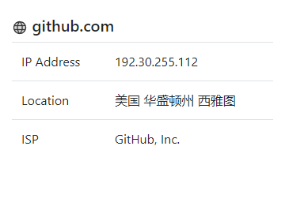

# domain_insight_extension

This is a simple Chrome extension that retrieves the domain of the current tab and fetches its corresponding IP information

**Screenshot**

**Install**

* Download the ZIP of this repo.
* Unzip
* Go to chrome extension.
* Click to check Developer mode
* Select *domain_insight_extension* directory then enjoy it  : )
